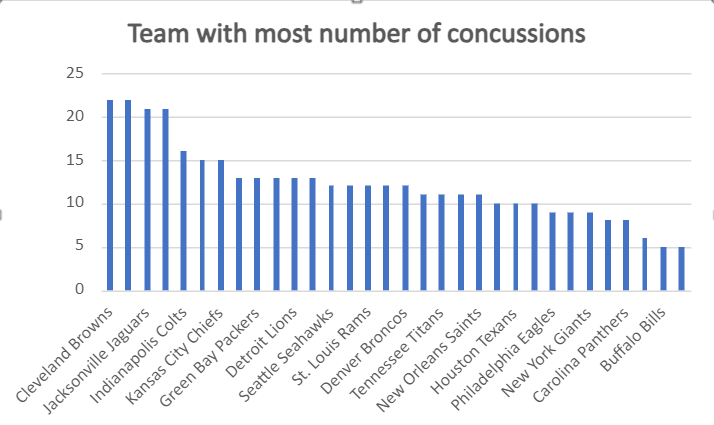
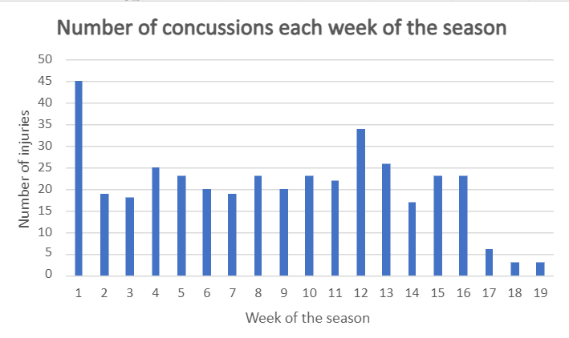
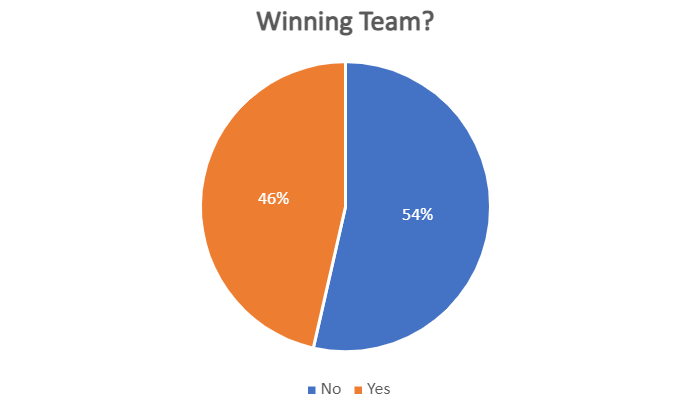
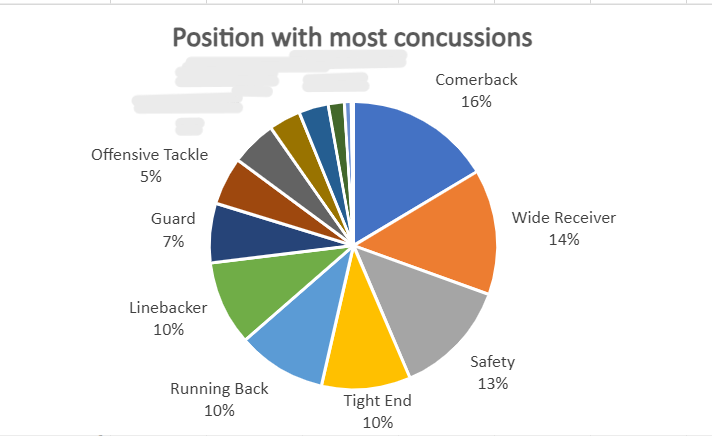

Question 1: What team had the most concussed players between the seasons 2012-2014?  

Question 2: Are concussions more likely to happen earlier or later in the season? 

Question 3: Is the winning or the loosing team more likely to have concussed players? 

 

Question 4: Are certain positions more susceptible to concussions? 

